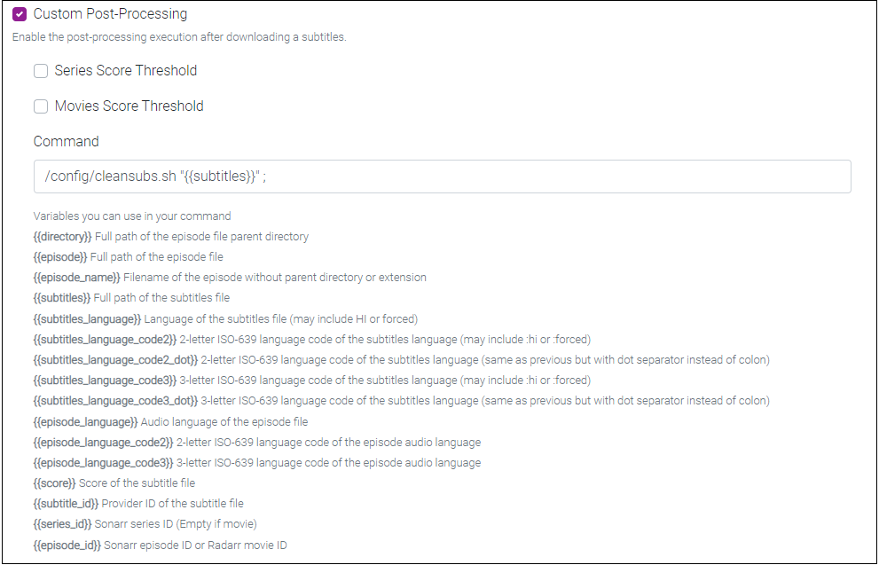
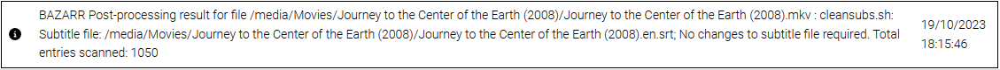
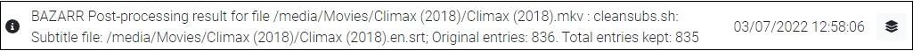
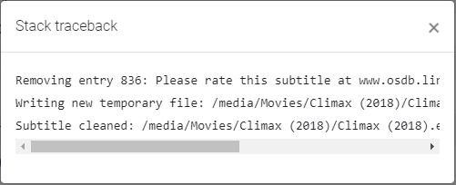

# About
A shell script to automatically remove common annoying scene branding and attribution entries from subtitle files.
Only .SRT format subtitles are supported.

# Installation
1. Place the `cleansubs.sh` shell script file in the root directory of Bazarr, usually `/config`
2. Configure a custom script from the Bazarr *Settings* > *Subtitles* screen by typing the following in the **Post-processing command** field (Note the double quotes!):  
   **`/config/cleansubs.sh -f "{{subtitles}}" ;`**  

   *Example*  
   

   >**NOTE:** The original subtitle file will be deleted/overwritten and permanently lost.

## Usage Details
The script is not configurable.  
The string matching only supports English at this time.

### Syntax
The syntax for the command-line is:  
`cleansubs.sh {-f|--file} <subtitle_file> [{-l|--log} <log_file>]

Where:

Option|Argument|Description
---|---|---
-f, --file|<subtitle_file>|The full path and file name to a subtitle file. In Bazarr, you should use the `{{subtitles}}` variable.
-d, --debug|\[\<level\>\]|Enables debug logging. Level is optional. Default of 1 (low) 2 includes extra output
-l, --log|<log_file>|The log file name Default of /config/log/cleansubs.log
--help| |Display help and exit.
--version| |Display version and exit.

### Logs
Script logs are integrated into the Bazarr log file. The text output of the script is designed to be compatible with the Bazarr log file format. This has been tested with Bazarr version(s):
- v0.8.2.4 - v1.3.0

*Example log entry with no changes*  

*Example log entry post cleaning*  

Removed subtitle entries are included in the Bazarr "Exception" details of each log entry.  

#### Additional Log
Because Bazarr rotates its log daily, I've found that having a separate script log file is beneficial.
By default, a separate log file is therefore created for script activity called:

`/config/log/cleansubs.log`

This log must be inspected or downloaded outside of Bazarr.  The log file name can be modified with the `--log` command-line option.

Script activity, including errors, will appear in both the script log and the native Bazarr log.

Log rotation is performed with 2 log files of 512KB each being kept.  

___

# Credits

This would not be possible without the following:

[Bazarr](https://www.bazarr.media/ "Bazarr homepage")  
[LinuxServer.io Bazarr](https://hub.docker.com/r/linuxserver/bazarr "Bazarr Docker container") container
